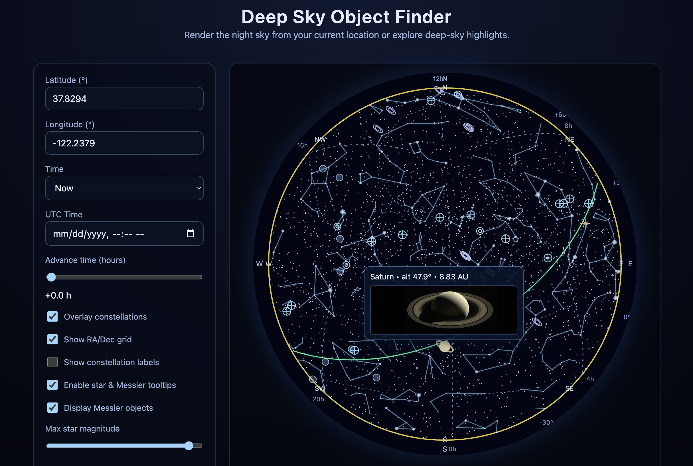

# Deep Sky Object Finder



Interactive night-sky explorer with supporting services for relational data access.

## Features

- Canvas-based star map with constellations, Messier objects, and solar-system data.
- Local tooltip imagery for Messier objects, planets, Moon, and Sun.
- Time controls, including custom timestamps and a slider to advance up to 24 hours.
- Horizon-direction labels, Messier tooltips, planet previews, and more UI enhancements.

## Data sources

- Bright stars: Yale Bright Star Catalog (V/50). After downloading `catalog.gz` from CDS, extract it under `data/catalog` and run `node scripts/tools/buildBrightStarCatalog.mjs`.
- Supplemental proper names: Optional integration from the HYG catalogue (`data/hyg_v36.csv`) before regenerating the bright star list.
- Constellations: Shapefiles curated within `data/constellations.js`.
- Messier catalogue: `data/messier.js` with external imagery linked in `images/messier/`.
- Planets & orbital elements: defined in `data/planets.js` and exposed via the services below.

## Services

### GraphQL API

TypeScript/Apollo service that exposes the DSOF catalog over GraphQL.

- Location: [`services/graphql`](services/graphql)
- Setup & usage: See [`services/graphql/README.md`](services/graphql/README.md)
- Sample requests: [`docs/curl/graph-queries.md`](docs/curl/graph-queries.md)

### Spring Boot REST API

Java 21 REST service backed by Spring Boot and MySQL.

- Location: [`services/spring-rest`](services/spring-rest)
- Setup & usage: See [`services/spring-rest/README.md`](services/spring-rest/README.md)
- Sample requests: [`docs/curl/rest-requests.md`](docs/curl/rest-requests.md)

## Database exports

Normalized schema definitions and load scripts are available for MySQL, Oracle, and DuckDB:

```
db/
  mysql/
    schema.sql
    load_data.sql
  oracle/
    schema.sql
    load_data.sql
  duckdb/
    schema.sql
    load_data.sql
```

Regenerate the load scripts after updating catalog data by running:

```bash
node scripts/tools/generateDatabaseSql.mjs
```

## Development quick start

1. Install dependencies for the web app as needed (the client is static HTML/JS).
2. Load the database schema/data (`db/mysql` recommended for services).
3. Launch the services you need:
   - GraphQL: `cd services/graphql && npm install && npm run dev`
   - REST: `cd services/spring-rest && ./gradlew bootRun`
4. Open `index.html` in a browser to explore the sky map.

## Tooling & scripts

- `scripts/tools/` contains generators for star catalogs and database exports.
- Images for Messier tooltips live under `images/messier/`; planet/moon/sun thumbnails under `images/planets/`.

## Contributing

Please copy/update data sources responsibly and respect licensing for external imagery.
